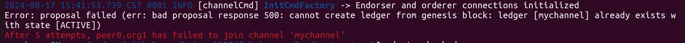
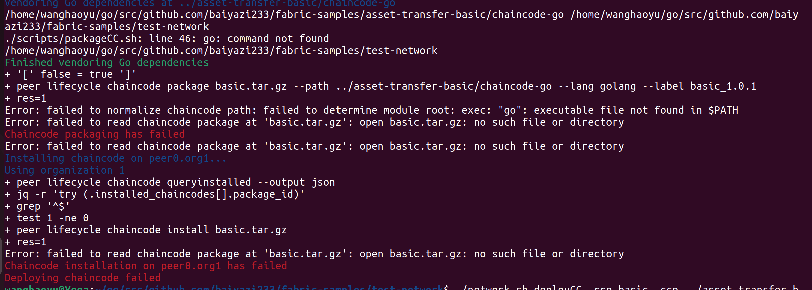
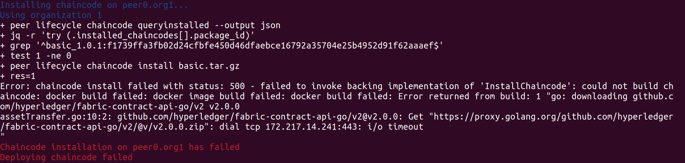

# Fabric网络部署
## docker安装
准备安装

```
#安装前先卸载操作系统默认安装的docker，
sudo apt-get remove docker docker-engine docker.io containerd runc

#安装必要支持
sudo apt install apt-transport-https ca-certificates curl software-properties-common gnupg lsb-release

#添加 Docker 官方 GPG key （可能国内现在访问会存在问题）
curl -fsSL https://download.docker.com/linux/ubuntu/gpg | sudo gpg --dearmor -o /usr/share/keyrings/docker-archive-keyring.gpg

# 阿里源（推荐使用阿里的gpg KEY）
curl -fsSL https://mirrors.aliyun.com/docker-ce/linux/ubuntu/gpg | sudo gpg --dearmor -o /usr/share/keyrings/docker-archive-keyring.gpg

#添加 apt 源:
#Docker官方源
echo "deb [arch=$(dpkg --print-architecture) signed-by=/usr/share/keyrings/docker-archive-keyring.gpg] https://download.docker.com/linux/ubuntu $(lsb_release -cs) stable" | sudo tee /etc/apt/sources.list.d/docker.list > /dev/null

#阿里apt源
echo "deb [arch=$(dpkg --print-architecture) signed-by=/usr/share/keyrings/docker-archive-keyring.gpg] https://mirrors.aliyun.com/docker-ce/linux/ubuntu $(lsb_release -cs) stable" | sudo tee /etc/apt/sources.list.d/docker.list > /dev/null

#更新源
sudo apt update
sudo apt-get update
```
安装Docker
```
#安装最新版本的Docker
sudo apt install docker-ce docker-ce-cli containerd.io
#等待安装完成

#查看Docker版本
sudo docker version

#查看Docker运行状态
sudo systemctl status docker
```
安装Docker 命令补全工具
```
sudo apt-get install bash-completion

sudo curl -L https://raw.githubusercontent.com/docker/docker-ce/master/components/cli/contrib/completion/bash/docker -o /etc/bash_completion.d/docker.sh

source /etc/bash_completion.d/docker.sh
```
docker源设置
```
sudo vim  /etc/docker/daemon.json

{
  "registry-mirrors": [
    "https://registry.docker-cn.com",
    "https://docker.mirrors.ustc.edu.cn",
    "https://hub-mirror.c.163.com",
    "https://mirror.baidubce.com",
    "https://ccr.ccs.tencentyun.com",
    "https://hub.atomgit.com",
    "https://docker.m.daocloud.io",
    "https://noohub.ru",
    "https://huecker.io",
    "https://dockerhub.timeweb.cloud",
    "https://docker.anyhub.us.kg",
    "https://dockerhub.jobcher.com",
    "https://dockerhub.icu"
  ]
}

#重启docker
sudo systemctl daemon-reload		#重启daemon进程
sudo systemctl restart docker		#重启docker

#docker命令走代理
sudo mkdir /etc/systemd/system/docker.service.d
cd /etc/systemd/system/docker.service.d
sudo vim proxy.conf

[Service] 
Environment="HTTP_PROXY=localhost:port" 
Environment="HTTPS_PROXY=localhost:port"
```
[docker安装参考](https://blog.csdn.net/u011278722/article/details/137673353?spm=1001.2014.3001.5501)
[docker国内镜像源配置及走代理设置](https://blog.csdn.net/Lichen0196/article/details/137355517)
[docker下载](https://download.docker.com/linux/static/stable/x86_64/)

## k3s
1.[install.sh](https://get.k3s.io)
2.[k3s bin](https://github.com/k3s-io/k3s/releases)
3.[k3s images](https://github.com/k3s-io/k3s/releases)

部署k3s
```
chmod +x k3s
chmod +x install.sh
cp k3s /usr/local/bin/
docker load -i k3s-airgap-images-amd64.tar
INSTALL_K3S_SKIP_DOWNLOAD=true ./install.sh --docker
kubectl -n kube-system edit secrets/k3s-serving
```

## 私有化镜像仓库

## 启动服务
https://github.com/hyperledger/fabric-samples/
使用test-network/network.sh脚本
[安装Fabric](https://hyperledger-fabric.readthedocs.io/en/latest/install.html)
[安装jq](https://blog.csdn.net/qq_43853055/article/details/113878450)
```
#下载
https://github.com/jqlang/jq/releases
tar -zxvf jq-1.5.tar.gz
cd jq-1.5
sudo ./configure && sudo make && sudo make install

#测试
echo '{"id":1,"name":"xhx"}' | jq .

#教程
https://stedolan.github.io/jq/tutorial/

```
```
1.创建组织与节点证书
sudo ./network.sh createChannel
2.部署合约
./network.sh deployCC -ccn basic -ccp ../asset-transfer-basic/chaincode-go -ccl go

```

解决办法：./network.sh down

解决办法：sudo chmod -R 777 ~/go
之后去掉sudo 执行 代码：./network.sh deployCC -ccn basic -ccp ../asset-transfer-basic/chaincode-go -ccl go 
[参考方案](https://blog.csdn.net/lakersssss24/article/details/119539472)

解决办法：
```
cd fabric-samples/asset-transfer-basic/chaincode-go

go env -w GOPROXY=https://goproxy.cn,direct
go env -w GO111MODULE=on
go mod vendor
```
[参考方案](https://blog.csdn.net/lakersssss24/article/details/119491099)